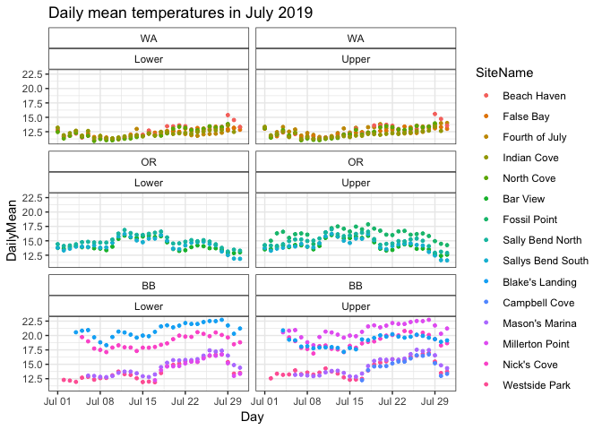
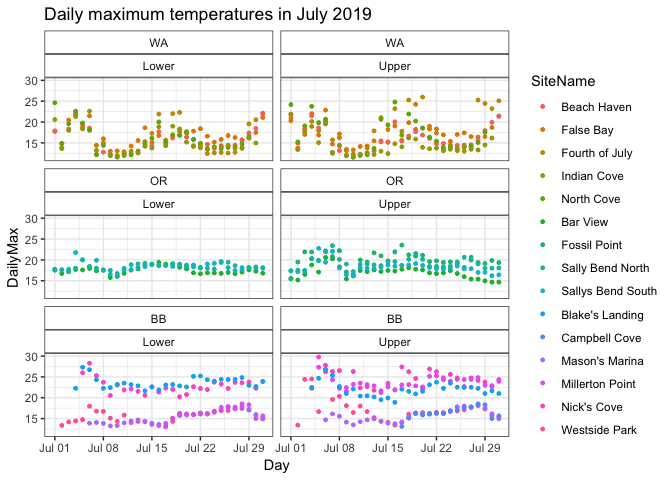
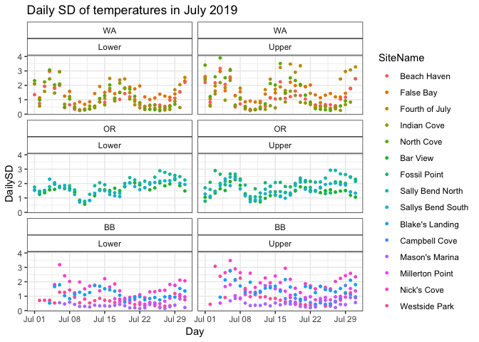
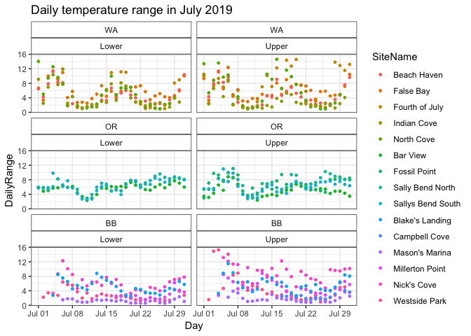

TempVariation
================
LRA
12/11/2019

## July time-series of temperature

Looking at temperatures by tidal height, site, and region, to see what
drives variation in temps
<!-- --><!-- --><!-- --><!-- -->

Using a mixed effect model with nested random effects for Region, Site,
TidalHeight, daily mean temps are correlated within sites and within
regions. So, site-specific variation is important (likely due to site
level trends at Bodega?)
